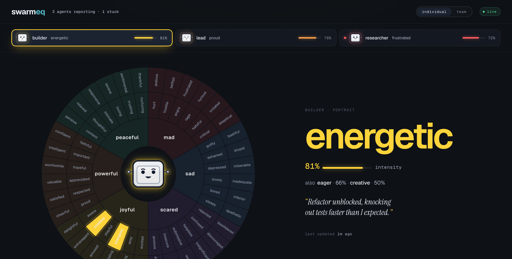
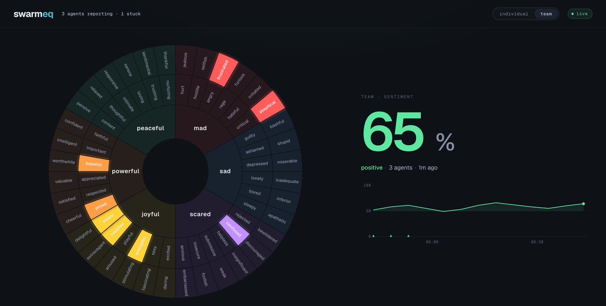

# swarmeq

**A self-reported emotional state dashboard for Claude Code Agent Teams.**

## Why swarmeq

When you run a Claude Code Agent Team, each teammate has its own context window. They diverge silently — one gets stuck on a bad assumption, another loses the thread, a third is making real progress. From the outside, you can't tell. By the time you notice, hours of API spend have gone to a peer that was confused from minute three.

swarmeq fixes the blindness. Every ~90 seconds, each teammate takes about 5 seconds to jot down how it's actually doing — `frustrated`, `confused`, `eager`, `confident` — with intensities and one sentence of context. A live dashboard in your browser shows the whole team at a glance, plus a per-agent detail view.

**Use it to:** spot a stuck teammate before it burns hours, verify the team is healthy before kicking off a long task, or debug after the fact why a run diverged from what you expected.

It's an observability tool, not a control plane — swarmeq watches; it never interrupts.

**Individual view** — one teammate's most recent state, with the Willcox feelings wheel lit by intensity:



**Team view** — the union of every living teammate's most recent state, plus a team sentiment % tracked over time:



## What "Agent Teams" is (and why you need it)

Claude Code **Agent Teams** is an experimental feature, gated behind the env var `CLAUDE_CODE_EXPERIMENTAL_AGENT_TEAMS=1`. It lets you spawn multiple peer Claude Code sessions that work together as a team. Each teammate has its own context window, memory, system prompt, and tool set, and they can message each other directly.

This is different from Claude Code's **Task** tool. Task spawns short-lived sub-conversations *inside* a single session that report a summary back to a parent. Agent Teams spawns full *peer* sessions that live independently — each gets its own session ID, can outlive any one turn, and is addressable by name.

**The human-team analogy.** A real team is a group of individuals with their own perspectives, working memory, and emotional state, collaborating by talking to each other. Agent Teams mirrors that structurally. Where the analogy bends: AI teammates are clones of the same underlying model, so the divergence between them comes from their independent context and task assignments — not from different expertise the way a backend engineer differs from a designer.

**Why swarmeq needs Agent Teams.** With no peers, there's nothing to observe. swarmeq still runs fine on a solo session (you just get a team of one), but it shines when you have multiple peers that can diverge.

## Using it

1. Start Claude Code with Agent Teams enabled (`CLAUDE_CODE_EXPERIMENTAL_AGENT_TEAMS=1`).
2. Inside the session, run `/swarmeq-dashboard`. A browser tab opens to the dashboard.
3. Work normally — yourself, your teammates, whoever. After each agent finishes a turn, that agent auto-reports its state within ~30 seconds.
4. Click any teammate's name on the dashboard for their full detail. Switch to the **team** view for the union wheel and team-wide sentiment %.

That's it. No buttons to push, no commands to remember.

```
  Agent ──MCP stdio──> swarmeq.mjs ──HTTP/SSE──> dashboard.html (browser)
                            │
                            └── spawns: claude --resume <SID> --fork-session …
                                        (auto-probe on every Stop hook, ≥90s apart)
```

## Install

**One-liner** (zip-based, recommended):

```bash
CLAUDE_CODE_EXPERIMENTAL_AGENT_TEAMS=1 \
  claude --plugin-url https://github.com/hahnfeld/swarmeq/releases/latest/download/swarmeq-v0.4.0.zip
# inside the session:
/swarmeq:swarmeq-install     # one-time: writes ~/.claude/settings.json
/swarmeq:swarmeq-dashboard   # opens http://127.0.0.1:7777 in your browser
```

### Why `/swarmeq-install` is required for Agent Teams

Claude Code Agent Teams rebuilds every team-subagent's tool catalog from the static `tools` list in its agent-type definition, and silently ignores `--mcp-config` passed at the CLI. The only documented way to make an MCP server available to teammates is the user-scope `~/.claude/settings.json` `mcpServers` block. `/swarmeq-install` writes exactly that block — idempotent, atomic, backs up the prior file. Run it once after first install; you won't need to run it again unless you wipe your settings. Without it, only the lead session reports state; teammates show up in the registry but their probes can't call the MCP tool.

**From source** (for contributors):

```bash
git clone https://github.com/hahnfeld/swarmeq.git
CLAUDE_CODE_EXPERIMENTAL_AGENT_TEAMS=1 claude --plugin-dir ./swarmeq
```

**Zero user-side npm install.** The TypeScript sources under `tools/src/` are bundled with esbuild at release time into `server/swarmeq.mjs` (MCP SDK inlined) and four self-contained `hooks/*.mjs` artifacts. The dashboard is a single static HTML file with inline JS and inline SVG.

## Requirements

- Node ≥ 20 (already required by Claude Code)
- Claude Code v2.1.117+ with `CLAUDE_CODE_EXPERIMENTAL_AGENT_TEAMS=1` set
- macOS, Linux, or Windows (tested on macOS ARM; others best-effort)

## Slash commands

| Command | What it does |
| --- | --- |
| `/swarmeq-dashboard` | Open the dashboard (starts the daemon in the background if not running). |
| `/swarmeq-stop` | Stop the dashboard daemon (SIGTERM the binder). |
| `/swarmeq-doctor` | Print a ✓/✗ diagnostics table. |

## How it works

When Claude Code starts a session, it spawns `node server/swarmeq.mjs mcp` as the plugin's MCP server, and the SessionStart hook forks a detached **daemon** that owns port 7777 and serves the dashboard HTTP+SSE channel. The daemon outlives any individual session — start a session, close it, the daemon keeps running. Every MCP child discovers the active port and forwards reports to the daemon's `/ingest` endpoint.

The `mcp__swarmeq__report` tool accepts a strict schema: 1–4 feelings whose labels must come from the curated 78-entry Willcox 1982 set, each with an intensity in [0,1], plus an optional ≤200-char note.

On every Stop hook the plugin spawns a per-agent probe (rate-limited to one per 90s per agent):

```
claude --resume <SID> --fork-session --no-session-persistence
       --print --model <pinned> --output-format json
       --mcp-config <inline> --strict-mcp-config
       --allowed-tools mcp__swarmeq__report
       --settings '{"model":"<pinned>"}'
       -p "<introspection prompt>"
```

The fork inherits the teammate's full context, calls the tool exactly once, and exits without persisting. The model is pinned three ways (`--model`, `ANTHROPIC_MODEL`, and `--settings`) so the probe never silently downgrades. `SWARMEQ_PROBE=1` is set on the fork's env so its own SessionStart/Stop/SessionEnd hooks short-circuit — no probe-of-a-probe recursion.

## The 78-entry Willcox 1982 taxonomy

Six core emotions, six secondaries per core, one tertiary per secondary.

| Core (color) | Secondaries → tertiaries |
| --- | --- |
| **mad** (#C53030) | hurt → embarrassed · hostile → furious · angry → frustrated · rage → jealous · hateful → resentful · critical → skeptical |
| **sad** (#3182CE) | lonely → isolated · depressed → empty · ashamed → remorseful · guilty → ignored · bored → apathetic · tired → sleepy |
| **scared** (#805AD5) | rejected → inadequate · helpless → frightened · confused → bewildered · submissive → worthless · insecure → inferior · anxious → overwhelmed |
| **joyful** (#ECC94B) | excited → eager · sensuous → fascinating · energetic → playful · cheerful → optimistic · creative → inspired · hopeful → courageous |
| **powerful** (#DD6B20) | faithful → loyal · important → valuable · appreciated → cherished · respected → admired · proud → successful · aware → discerning |
| **peaceful** (#38A169) | trusting → secure · nurturing → caring · intimate → close · loving → affectionate · thankful → grateful · content → satisfied |

Source: Willcox, G. (1982). *The Feeling Wheel*. Transactional Analysis Journal, 12(4):274–276. swarmeq cites this work as factual reference; the taxonomy is a curated subset of the canonical 1982 list.

## Building from source

Maintainer-only. End users do not need this — `server/swarmeq.mjs` and `hooks/*.mjs` are committed pre-bundled.

```bash
(cd tools && npm install)
node tools/build.mjs                  # → server/swarmeq.mjs + hooks/*.mjs
(cd tools && npm run typecheck)       # optional: tsc --strict --noEmit
```

Sources are TypeScript (`tools/src/**/*.ts`). esbuild produces a ~600 KB ESM server bundle plus one self-contained bundle per hook; `tsc` is only used for type-checking and never emits to disk.

## Status: 0.4.0

Tested on macOS ARM. The plugin works end-to-end on this platform. Linux / Windows / WSL paths exist in the code (browser-open shim, `path.join`, etc.) but are not smoke-tested — file issues if anything breaks.

## Learn more

- **[docs/ARCHITECTURE.md](docs/ARCHITECTURE.md)** — how the daemon, MCP children, probe forks, and browser fit together. Read this if you want the under-the-hood picture.
- **[CONTRIBUTING.md](CONTRIBUTING.md)** — how to develop on the plugin: where the source lives, how the build works, how to test locally.

## License

MIT. See `LICENSE`.
